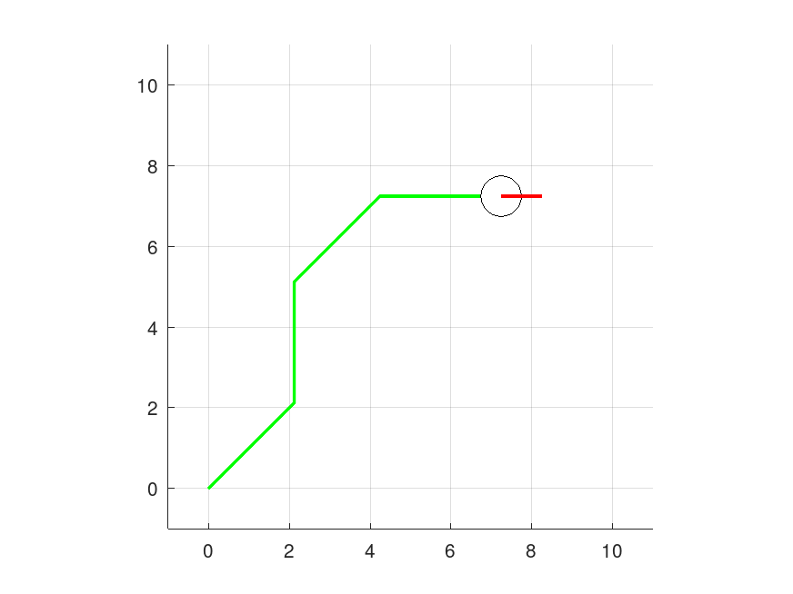

# Опис положення та руху мобільної платформи

Платформа уявляє собою мобільного робота (наприклад робопилососа), що рухається по горизонтальній площині.

Рухома платформа може виконувати 2 типи руху:

1. Лінійне переміщення вперед на деяку відстань

2. Доворот на певний кут

Для математичного опису рухів використовуються матриці трансформації у гомогенній системі координат

## Завдання

1. Скласти матрицю гомогенної 2D трансформації зміщення та реалізувати її у вигляді функції `hposmat.m`;

2. Скласти матрицю гомогенної 2D трансформації обертання та реалізувати її у вигляді функції `hrotmat.m`;

## Перелік файлів

`run.m` - основний файл

`hposmat.m` - файл генерації матриці зміщення у гомогенній системі координат

`hrotmat.m` - файл генерації матриці обертання у гомогенній системі координат

## Питання для самоконтролю

1. Які існують види рухів матеріальних обєктів.

2. Яким чином задається положення рухомого обєкту у просторі

3. Що таке гомогенна трансформація

4. В чому полягають особливості опису положення у гомогенній системі координат

## Посилання

1. Bruno Siciliano, Springer Handbook of Robotics, 2008
