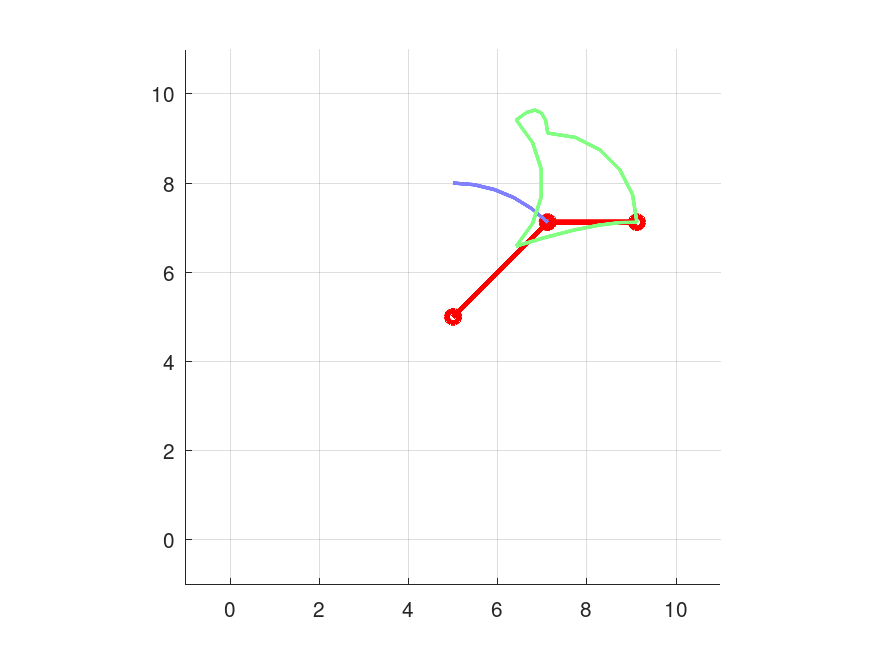

# Опис положення та руху двосегментного робота

Моделлю роботу є двосегментна робо-рука, що рухається у двовимірній площині

Двосегментний робот може виконувати 2 рухи:

1. Змінювати кут положення сегменту 1 відносно опорної системи координат

2. Змінювати кут положення сегменту 2 відносно сегменту 1.

Для математичного опису рухів використовуються матриці трансформації у гомогенній системі координат

## Завдання

1. Скласти 2D матрицю гомогенної трансформації сегменту 1 при повороті на кут t1 та задати її у функції `realrobot.m`;

2. Скласти 2D матрицю гомогенної трансформації обертання сегменту 2 відносно сегменту 1 на кут t2 та задати її у функції `realrobot.m`;

## Перелік файлів

`run.m` - основний файл

`fakerobot.m` - файл генерації еталоних координат сегментів робота (не потрібно редагувати)

`realrobot.m` - файл генерації координат сегментів робота з використанням гомогенних трансформацій

## Питання для самоконтролю

1. Яким чином виконуєтья опис обертового сегменту робота маніпулятора

2. Яким чином виконуєтья опис лінійного зміщення сегменту робота маніпулятора

3. В чому полягає особливість при описі обертового руху послідовно з'єднаних сегментів робота

4. Яким чином повязані сигнали керування та траєкторія просторового руху сегментів робота

## Посилання

1. Bruno Siciliano, Springer Handbook of Robotics, 2008
